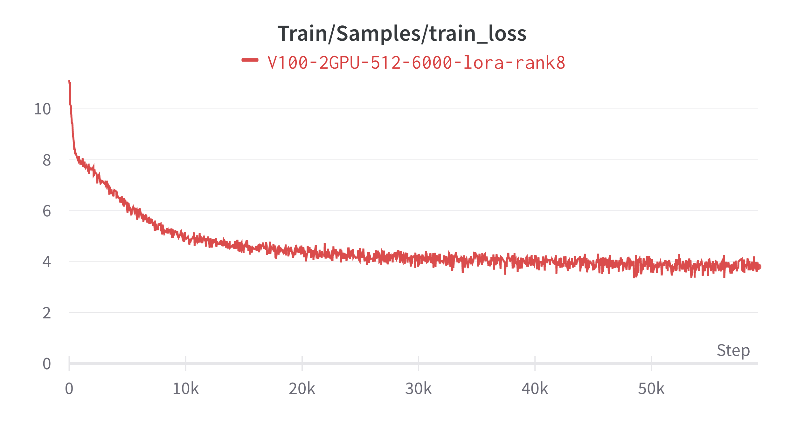

**Llama2在中文医疗数据集上的二次预训练**
- 中文医疗数据集介绍
- 二次预训练方式
- 二次预训练期间踩过的坑
- 预训练结果

**中文医疗数据集介绍**
- 源自Huggingface平台：[shibing624/medical](https://huggingface.co/datasets/shibing624/medical/viewer/pretrain/train)
- 数据总量362K条，其中训练集361K条、评估集500条和测试集500条
- 数据样本：
```json
{"text": "外阴上皮样肉瘤的并发症？易并发感染。伴发区域淋巴结转移性肿大，后期常转移至肺。"}
```

**二次预训练方式**
- 训练参数范围：
  - 范围一：`embed_tokens layer` 和 `lm_head layer`
    - 参看脚本`run_clm_pt.py`
  - 范围二：`embed_tokens layer` 、`lm_head layer` 和 `peft Lora layer`
    - 参看脚本`run_clm_pt_with_peft.py`
    - 参看脚本`run_clm_pt_with_peft_ds.py`
- 分布式训练框架：
  - Pytorch原生训练框架：数据并行DDP 和 混合精度AMP
    - 参看脚本`run_clm_pt.py`
    - 参看脚本`run_clm_pt_with_peft.py`
  - Deepspeed训练框架：数据并行、混合精度、ZeRO
    - 参看脚本`run_clm_pt_with_peft_ds.py`
- 分布式训练类型：单机多卡_单进程单卡，单卡要能容纳相应精度的模型
  
**模型参数占内存大小估算**
|精度|描述|字节数|
|:--|:--|:--|
|float32|单精度|4字节|
|float16/bf16|半精度|2字节|
|int8|8位整数|1字节|
|int4|4位整数|0.5字节|

|参数单位|参数量级|取值|比较|内存量级|取值|
|:--|:--|:--|:--|:--|:--|
|1K|千|1000|<->|1KB|1024B|
|1M|百万|1000K|<->|1MB|1024KB|
|1B|十亿|1000M|<->|1GB|1024MB|

**训练期间踩过的坑**
- 训练期间要监控内存和`GPU`显存占用率，防止内存不足导致训练中断，尤其在加载模型时，一般会先加载模型至内存，再拷贝至`GPU`，要及时释放内存中的模型，减少内存占用
- 模型下载和数据预处理 放在主进程中进行，同时阻塞其它副本进程，可通过`torch.distributed.barrier()`实现
- 通过上下文管理器实现主进程执行特殊逻辑，同时阻塞其它进程的方式，无法达到目的，暂时不知具体原因。我们尝试了两种无效方式：`torch_distributed_zero_first` 和 `transformers.TrainingArguments.main_process_first`；为解决该问题，我们手动实现了该逻辑
- 在进行数据并行前，模型要转移至`GPU`，即用`DDP`或`deepspeed.initialize`包裹前
- 在进行数据并行前，要创建`optimizer`和`scheduler`
- `torch.save`模型时，会保存模型当前时刻的`device`信息，后续`torch.load`加载模型时，要设置好`map_location`参数，否则模型会自动加载至其保存时的`device`上。在单机多卡时，会导致某张GPU上的模型被加载至另一张卡(模型保存时的卡)，进而训练卡死
- 多卡的`checkpoint`不要直接`load`，指定`load`加载至`cpu`再加载至指定`GPU`，会缓解`GPU0`的压力
- 用`torchrun`或`deepspeed`启动训练脚本时，其环境变量自带`local_rank`，你需要在脚本中解析该参数，但无需在启动脚本中输入该参数
- 分布式参数获取`local_rank`、`global_rank`和`world_size`，需要在训练脚本开头初始化`torch.distributed.init_process_group(backend='nccl')`后才能获取，获取方式`local_rank = int(os.environ['LOCAL_RANK'])` 、`global_rank = int(os.environ['RANK'])` 和 `global_rank = torch.distributed.get_rank()`
- `torch.distributed.init_process_group(backend='nccl', init_method='env://')` 中`init_method='env://'`，会默认从系统环境变量中获取`rank`和`local_rank`信息(这些信息会由torchrun或deepspeed自动创建)，用于进程间的通信；`init_method`也可以指定为URL、TCP或共享文件系统的方式初始化进程组，构建进程间通信方式(实质是主进程所在节点IP和端口，`MASTER_PORT` `MASTER_ADDR`其它进程都会和它进程通信，但彼此间并不通信)，具体可参看[PyTorch文档](https://pytorch.org/docs/stable/distributed.html)
- `wandb`在记录信息时，会跟踪全局`step`(`self._step`)，并且当前`step`值不能小于`wandb`内部的`self._step`值，该值每调用`wandb.log`一次都会增1，如果当前`step`大于`self._step`，则`self._step`会更新为当前值；如果小于，则不会记录
- 模型并行时，`deepspeed`时，会自动分配`GPU`给相应`layer`；`pytorch`则需要在实现模型时手动显示实现`layer`迁移和相应输出迁移
- 评估时，最好同时在多卡上进行，但需要在主进程上执行`tensor`的`reduce`操作，将各设备上的值`gather`后进行`reduce`，`pytorch`的`NCCL`后端仅支持`GPU`上的操作，因此`tensor`必须事先迁移至`GPU`上
- 分布式训练时，建议直接用`deepspeed`
- 在构建`DataLoader`时，需要采用`torch.utils.data.distribued.DistributedSampler`数据分配器，它会根据进程的 `world_size`和`local_rank`将数据集切分为`world_size`份，并基于`local_rank`进行数据集`index`的范围分配，如果希望每个epoch中，每个进程拿到的数据不同，则需要在epoch前执行`dataloader.sampler.set_epoch(epoch)`调整每个进程获取到的index范围，并且`DataLoader`中的`shuffle`要设为`False`
- 每个进程都拥有完整的数据集，`torch.utils.data.distribued.DistributedSampler`用于给他们分配数据的`index`，避免数据传输

**预训练结果**

|Llama layer|Lora layer|训练参数量|总参数量|占比|模型存储|
|:--|:--|:--|:--|:--|:--|
|embed_tokens、lm_head|q_proj、v_proj|1,002,176,512|7,494,242,304|13.4%|data/lora_adapter/q_proj_v_proj_embed_tokens_lm_head|



|Llama layer|Lora layer|训练参数量|总参数量|占比|训练结果|模型存储|
|:--|:--|:--|:--|:--|:--|:--|
|embed_tokens、lm_head|q_proj,v_proj,k_proj,o_proj,gate_proj,down_proj,up_proj|1,017,970,688|7,494,242,304|13.58%|...|...|
